# Agent Workflow Architecture

## WorkflowBuilder Graph (Current Implementation)

```mermaid
flowchart TB
    subgraph UI["User Interfaces"]
        CLI["CLI<br/><code>app/cli.py</code>"]
        Web["Streamlit Web UI<br/><code>app/web.py</code>"]
    end

    User(("👤 User")) --> CLI & Web

    CLI & Web --> Workflow

    subgraph Workflow["WorkflowBuilder Graph<br/><code>app/workflows/main_workflow.py</code>"]
        direction TB
        
        Triage["🎯 TriageExecutor<br/><code>app/agents/triage.py</code><br/><i>Classify intent & extract metadata</i>"]
        
        KnowledgeLookup["🔍 KnowledgeLookupExecutor<br/><code>app/executors/knowledge_lookup.py</code><br/><i>Deterministic tag-based search</i>"]
        
        subgraph ConditionalRouting["Conditional Routing<br/><i>Based on TriageResult.intent</i>"]
            QuestionHandler["💬 QuestionHandlerExecutor<br/><code>app/agents/question_handler.py</code><br/><i>Synthesize answers from context</i>"]
            IngestionPreview["📥 IngestionPreviewExecutor<br/><code>app/agents/ingestion_preview.py</code><br/><i>Preview knowledge writes</i>"]
        end
        
        ResponseFormatter["📋 ResponseFormatterExecutor<br/><code>app/executors/response_formatter.py</code><br/><i>Format WorkflowOutput</i>"]
        
        Triage -->|"always"| KnowledgeLookup
        KnowledgeLookup -->|"intent: question/both"| QuestionHandler
        KnowledgeLookup -->|"intent: ingestion/both"| IngestionPreview
        QuestionHandler --> ResponseFormatter
        IngestionPreview --> ResponseFormatter
    end

    subgraph Tools["Standalone Tool Functions<br/><code>app/tools/</code>"]
        direction TB
        
        subgraph URLTools["🔗 URL Scraper<br/><code>url_scraper.py</code>"]
            fetch_url["fetch_url()"]
        end
        
        subgraph RetrievalTools["🏷️ Knowledge Retrieval<br/><code>knowledge_retrieval.py</code>"]
            get_available_tags["get_available_tags()"]
            search_by_tags["search_by_tags()"]
        end
        
        subgraph IngestionTools["📝 Knowledge Ingestion<br/><code>knowledge_ingestion.py</code>"]
            add_url_to_index["add_url_to_index()"]
            update_instructions_file["update_instructions_file()"]
            create_note["create_note()"]
            get_knowledge_status["get_knowledge_status()"]
        end
        
        subgraph ContextTools["📚 Org Context<br/><code>org_context.py</code>"]
            get_instructions_context["get_instructions_context()"]
            get_notes_index["get_notes_index()"]
            read_note["read_note()"]
            get_url_index["get_url_index()"]
            search_knowledge["search_knowledge()"]
        end
    end

    Triage -.->|"uses (via ChatAgent)"| fetch_url
    QuestionHandler -.->|"uses (via ChatAgent)"| get_instructions_context & read_note & search_knowledge
    IngestionPreview -.->|"uses (via ChatAgent)"| add_url_to_index & update_instructions_file & create_note & get_knowledge_status
    KnowledgeLookup -.->|"calls directly"| get_available_tags & search_by_tags

    fetch_url -->|"httpx + lxml"| Internet(("🌐 Web"))

    subgraph Knowledge["Knowledge Store<br/><code>knowledge/</code>"]
        context_md["📄 context.md<br/><i>Org-level context</i>"]
        url_index["📋 sources/url_index.yaml<br/><i>Indexed URLs</i>"]
        notes_index["📋 notes/_index.yaml<br/><i>Notes index</i>"]
        notes_files["📝 notes/*.md<br/><i>Detailed notes</i>"]
    end

    get_instructions_context & search_knowledge --> context_md
    get_notes_index & search_by_tags --> notes_index
    read_note --> notes_files
    get_url_index & search_by_tags --> url_index

    update_instructions_file --> context_md
    add_url_to_index --> url_index
    create_note --> notes_files & notes_index

    get_available_tags --> notes_index & url_index

    subgraph Infra["Infrastructure"]
        ChatClient["💬 ChatClient<br/><code>app/chat_client.py</code><br/><i>Provider-agnostic factory</i>"]
        Ollama["🦙 Ollama<br/><i>Local LLM (default)</i>"]
        AzureOpenAI["☁️ Azure OpenAI<br/><i>Cloud LLM (optional)</i>"]
        Config["⚙️ Config<br/><code>config/config.yaml</code>"]
        Metrics["📊 Metrics<br/><code>metrics/</code>"]
    end

    ChatClient --> Ollama & AzureOpenAI
    Triage & QuestionHandler & IngestionPreview -.->|"ChatAgent"| ChatClient
    Workflow -.-> Config
    Workflow -.-> Metrics

    style User fill:#f9f,stroke:#333
    style Workflow fill:#e8f4f8,stroke:#4a90d9
    style Triage fill:#4a90d9,color:#fff,stroke:#2a6cb9
    style KnowledgeLookup fill:#95a5a6,color:#fff,stroke:#7f8c8d
    style QuestionHandler fill:#6ab04c,color:#fff,stroke:#4a8a2c
    style IngestionPreview fill:#e17055,color:#fff,stroke:#c15035
    style ResponseFormatter fill:#95a5a6,color:#fff,stroke:#7f8c8d
    style Tools fill:#fef5e7,stroke:#f39c12
    style Knowledge fill:#dfe6e9,stroke:#b2bec3
    style Infra fill:#ffeaa7,stroke:#dda84e
    style ConditionalRouting fill:#fff,stroke:#999,stroke-dasharray: 5 5
```



## Flow Summary

1. **User** interacts via CLI or Streamlit Web UI
2. **WorkflowBuilder Graph** processes the request through a series of executors:
   - **TriageExecutor** (LLM): Classifies user intent (`question`, `ingestion`, or `both`) and extracts metadata (domain, tags, cleaned query/content)
   - **KnowledgeLookupExecutor** (deterministic): Performs tag-based search across notes and URLs
   - **Conditional Routing**: Based on `TriageResult.intent`:
     - `question` or `both` → **QuestionHandlerExecutor** (LLM): Synthesizes answers from retrieved context
     - `ingestion` or `both` → **IngestionPreviewExecutor** (LLM): Generates preview of proposed knowledge base writes
   - **ResponseFormatterExecutor** (deterministic): Formats final `WorkflowOutput` with structured results
3. **Executors** are registered as factories with `WorkflowBuilder.register_executor()` for lazy instantiation per workflow run
4. **LLM-backed executors** (Triage, QuestionHandler, IngestionPreview) wrap `ChatAgent` instances that use tools
5. **Tools** are standalone sync functions in `app/tools/`, decorated with `@track_tool_call` for metrics
6. **Knowledge store** (`knowledge/`) provides:
   - `context.md` — high-level organizational context
   - `sources/url_index.yaml` — indexed URLs with metadata
   - `notes/` — detailed markdown notes with YAML frontmatter
7. **ChatClient factory** (`app/chat_client.py`) provides provider-agnostic access to Ollama (default) or Azure OpenAI
8. All configuration, logging, and metrics are centralized

## Data Flow

```
User Input (str)
  ↓
TriageResult (intent, domain, tags, cleaned_query/raw_content, source_url)
  ↓
LookupResult (matches, match_count, has_sufficient_context, triage passthrough)
  ↓
  ├─→ QuestionResult (answer, confidence, sources_used, suggest_web_search)
  └─→ IngestionPreviewResult (action, target_path, preview_content, related_existing)
  ↓
WorkflowOutput (intent, question_result, ingestion_result, sources, summary)
```

## Key Patterns

- **Executor Types**:
  - LLM-backed (`Executor` subclass wrapping `ChatAgent` with tools): Triage, QuestionHandler, IngestionPreview
  - Deterministic (`Executor` subclass with sync logic): KnowledgeLookup, ResponseFormatter
- **Conditional Edges**: Routing functions (`_route_to_question`, `_route_to_ingestion`) inspect `LookupResult.triage.intent`
- **Lazy Initialization**: Executors registered as lambda factories to avoid shared state across runs
- **Structured Output**: Pydantic models (`app/models.py`) enforce type safety between stages
