# Agent Workflow Architecture

## WorkflowBuilder Graph (Current Implementation)

```mermaid
flowchart TB
    subgraph UI["User Interfaces"]
        CLI["CLI<br/><code>app/cli.py</code>"]
        Web["Streamlit Web UI<br/><code>app/web.py</code>"]
    end

    User(("👤 User")) --> CLI & Web

    CLI & Web --> Workflow

    subgraph Workflow["WorkflowBuilder Graph<br/><code>app/workflows/main_workflow.py</code>"]
        direction TB
        
        Triage["🎯 TriageExecutor<br/><code>app/agents/triage.py</code><br/><i>Classify intent & extract metadata</i>"]
        
        KnowledgeLookup["🔍 KnowledgeLookupExecutor<br/><code>app/executors/knowledge_lookup.py</code><br/><i>Deterministic tag-based search</i>"]
        
        subgraph ConditionalRouting["Conditional Routing<br/><i>Based on TriageResult.intent</i>"]
            QuestionHandler["💬 QuestionHandlerExecutor<br/><code>app/agents/question_handler.py</code><br/><i>Synthesize answers from context</i>"]
            IngestionPreview["📥 IngestionPreviewExecutor<br/><code>app/agents/ingestion_preview.py</code><br/><i>Preview knowledge writes</i>"]
        end
        
        ResponseFormatter["📋 ResponseFormatterExecutor<br/><code>app/executors/response_formatter.py</code><br/><i>Format WorkflowOutput</i>"]
        
        Triage -->|"always"| KnowledgeLookup
        KnowledgeLookup -->|"intent: question/both"| QuestionHandler
        KnowledgeLookup -->|"intent: ingestion/both"| IngestionPreview
        QuestionHandler --> ResponseFormatter
        IngestionPreview --> ResponseFormatter
    end

    subgraph RefinementLoop["Ingestion Refinement Loop<br/><i>(UI-layer, bypasses workflow)</i>"]
        direction LR
        PendingPreview["📝 Pending Preview<br/><code>st.session_state.pending_ingestions</code>"]
        RefineAgent["🔄 refine_ingestion_preview()<br/><code>app/agents/ingestion_preview.py</code>"]
        PendingPreview -->|"user feedback"| RefineAgent
        RefineAgent -->|"updated preview"| PendingPreview
    end

    Web -->|"Approve"| ExecuteIngestion["✅ execute_ingestion()<br/><code>app/web.py</code>"]
    Web -->|"Dismiss"| Discard["❌ Discard preview"]
    Web -.->|"pending preview exists"| RefinementLoop

    subgraph Tools["Standalone Tool Functions<br/><code>app/tools/</code>"]
        direction TB
        
        subgraph URLTools["🔗 URL Scraper<br/><code>url_scraper.py</code>"]
            fetch_url["fetch_url()"]
        end
        
        subgraph RetrievalTools["🏷️ Knowledge Retrieval<br/><code>knowledge_retrieval.py</code>"]
            get_available_tags["get_available_tags()"]
            search_by_tags["search_by_tags()"]
        end
        
        subgraph IngestionTools["📝 Knowledge Ingestion<br/><code>knowledge_ingestion.py</code>"]
            add_url_to_index["add_url_to_index()"]
            update_instructions_file["update_instructions_file()"]
            create_note["create_note()"]
            get_knowledge_status["get_knowledge_status()"]
        end
        
        subgraph ContextTools["📚 Org Context<br/><code>org_context.py</code>"]
            get_instructions_context["get_instructions_context()"]
            get_notes_index["get_notes_index()"]
            read_note["read_note()"]
            get_url_index["get_url_index()"]
            search_knowledge["search_knowledge()"]
        end
    end

    Triage -.->|"uses (via ChatAgent)"| fetch_url
    QuestionHandler -.->|"uses (via ChatAgent)"| get_instructions_context & read_note & search_knowledge
    IngestionPreview -.->|"uses (via ChatAgent)"| get_knowledge_status & fetch_url
    ExecuteIngestion -.->|"calls directly"| add_url_to_index & update_instructions_file & create_note
    KnowledgeLookup -.->|"calls directly"| get_available_tags & search_by_tags

    fetch_url -->|"httpx + lxml"| Internet(("🌐 Web"))

    subgraph Knowledge["Knowledge Store<br/><code>../knowledge/</code><br/><i>Per-domain stores</i>"]
        direction TB
        subgraph DomainN["Domain: <i>&lt;name&gt;</i>"]
            context_md["📄 context.md<br/><i>Domain-level context</i>"]
            url_index["📋 url_index.yaml<br/><i>Indexed URLs</i>"]
            notes_index["📋 notes/_index.yaml<br/><i>Notes index</i>"]
            notes_files["📝 notes/*.md<br/><i>Detailed notes</i>"]
            note_template["📋 note_template.md<br/><i>Domain template</i>"]
        end
    end

    get_instructions_context & search_knowledge --> context_md
    get_notes_index & search_by_tags --> notes_index
    read_note --> notes_files
    get_url_index & search_by_tags --> url_index

    update_instructions_file --> context_md
    add_url_to_index --> url_index
    create_note --> notes_files & notes_index

    get_available_tags --> notes_index & url_index

    subgraph Infra["Infrastructure"]
        ChatClient["💬 ChatClient Factory<br/><code>app/chat_client.py</code><br/><i>Provider-agnostic</i>"]
        Ollama["🦙 Ollama<br/><i>Local LLM (default)</i>"]
        OpenAI["🤖 OpenAI<br/><i>Cloud API (optional)</i>"]
        AzureOpenAI["☁️ Azure OpenAI<br/><i>Enterprise (optional)</i>"]
        Config["⚙️ Config<br/><code>config/config.yaml</code>"]
        Metrics["📊 Metrics<br/><code>metrics/</code>"]
        Tracing["🔭 Tracing<br/><code>app/tracing.py</code><br/><i>OpenTelemetry / OTLP</i>"]
    end

    ChatClient --> Ollama & OpenAI & AzureOpenAI
    Triage & QuestionHandler & IngestionPreview -.->|"ChatAgent"| ChatClient
    RefineAgent -.->|"ChatAgent"| ChatClient
    Workflow -.-> Config
    Workflow -.-> Metrics
    Workflow -.-> Tracing

    style User fill:#f9f,stroke:#333
    style Workflow fill:#e8f4f8,stroke:#4a90d9
    style Triage fill:#4a90d9,color:#fff,stroke:#2a6cb9
    style KnowledgeLookup fill:#95a5a6,color:#fff,stroke:#7f8c8d
    style QuestionHandler fill:#6ab04c,color:#fff,stroke:#4a8a2c
    style IngestionPreview fill:#e17055,color:#fff,stroke:#c15035
    style ResponseFormatter fill:#95a5a6,color:#fff,stroke:#7f8c8d
    style Tools fill:#fef5e7,stroke:#f39c12
    style Knowledge fill:#dfe6e9,stroke:#b2bec3
    style Infra fill:#ffeaa7,stroke:#dda84e
    style ConditionalRouting fill:#fff,stroke:#999,stroke-dasharray: 5 5
    style RefinementLoop fill:#fce4ec,stroke:#e17055,stroke-dasharray: 5 5
    style ExecuteIngestion fill:#28a745,color:#fff,stroke:#1e7e34
    style RefineAgent fill:#e17055,color:#fff,stroke:#c15035
```



## Flow Summary

1. **User** interacts via CLI or Streamlit Web UI
2. **WorkflowBuilder Graph** processes the request through a series of executors:
   - **TriageExecutor** (LLM): Classifies user intent (`question`, `ingestion`, or `both`) and extracts metadata (domain, tags, cleaned query/content). Domain list is dynamically injected from `config.yaml`.
   - **KnowledgeLookupExecutor** (deterministic): Performs tag-based search across all configured knowledge domains
   - **Conditional Routing**: Based on `TriageResult.intent`:
     - `question` or `both` → **QuestionHandlerExecutor** (LLM): Synthesizes answers from retrieved context
     - `ingestion` or `both` → **IngestionPreviewExecutor** (LLM): Generates preview of proposed knowledge base writes (does *not* execute writes)
   - **ResponseFormatterExecutor** (deterministic): Formats final `WorkflowOutput` with structured results
3. **Ingestion Approval Flow** (web UI only):
   - Ingestion previews are stored in `st.session_state.pending_ingestions`
   - User can **Approve** (calls `execute_ingestion()` → dispatches to `create_note`/`add_url_to_index`/`update_instructions_file`) or **Dismiss**
   - While a preview is pending, subsequent chat messages enter **Refinement Mode**: routed to `refine_ingestion_preview()` instead of the full workflow
   - Refinement sends the current preview JSON + user feedback to a fresh ChatAgent, parses the updated proposal, and replaces the pending preview in-place
   - Approve or Dismiss exits refinement mode and returns to normal workflow routing
4. **Executors** are registered as factories with `WorkflowBuilder.register_executor()` for lazy instantiation per workflow run
5. **LLM-backed executors** (Triage, QuestionHandler, IngestionPreview) wrap `ChatAgent` instances that use tools
6. **Tools** are standalone sync functions in `app/tools/`, decorated with `@track_tool_call` for metrics
7. **Knowledge store** (`../knowledge/`) provides per-domain stores:
   - Each domain (e.g., `general`, `technology`, `social`, `entertainment`) has its own directory
   - `context.md` — domain-level context
   - `url_index.yaml` — indexed URLs with metadata
   - `notes/` — detailed markdown notes with YAML frontmatter, indexed by `_index.yaml`
   - `note_template.md` — per-domain template generated from base template with customized frontmatter
8. **ChatClient factory** (`app/chat_client.py`) provides provider-agnostic access to:
   - **Ollama** (default, local inference)
   - **OpenAI** (cloud API)
   - **Azure OpenAI** (enterprise cloud)
9. **OpenTelemetry tracing** (`app/tracing.py`) — optional OTLP gRPC export for debugging/monitoring
10. Domain validation and auto-initialization on startup (web: auto-init, CLI: interactive prompt)

## Data Flow

```
User Input (str)
  ↓
TriageResult (intent, domain, tags, cleaned_query/raw_content, source_url)
  ↓
LookupResult (matches across all domains, match_count, has_sufficient_context, triage passthrough)
  ↓
  ├─→ QuestionResult (answer, confidence, sources_used, suggest_web_search)
  └─→ IngestionPreviewResult (action, target_path, preview_content, domain, tags, confidence, relevance)
  ↓
WorkflowOutput (intent, question_result, ingestion_result, sources, summary)
  ↓
  [If ingestion preview] → Pending Ingestion → User Approve/Dismiss
                                             ↑
                                     Refinement Loop
                                  (user feedback → refine_ingestion_preview → updated preview)
```

## Ingestion Lifecycle

```
1. User submits content (URL, text, facts)
        ↓
2. Triage classifies intent as "ingestion" or "both"
        ↓
3. IngestionPreviewExecutor proposes an action (create_note / add_url / update_context / skip)
        ↓
4. Preview rendered in UI with badges (action, domain, confidence, tags)
        ↓
5. User may refine the preview via chat (refinement mode)
   └─→ refine_ingestion_preview() re-sends preview + feedback to LLM
   └─→ Updated preview replaces the pending one
        ↓
6. User clicks "Approve" → execute_ingestion() writes to knowledge store
   OR  User clicks "Dismiss" → preview discarded
```

## Knowledge Domain Structure

```
../knowledge/                    ← Lives outside the app repo
├── general/
│   ├── context.md               ← Domain-level org context
│   ├── url_index.yaml           ← Indexed URLs with metadata
│   ├── note_template.md         ← Per-domain note template (auto-generated)
│   └── notes/
│       ├── _index.yaml          ← Notes index with metadata
│       └── *.md                 ← Individual notes with YAML frontmatter
├── technology/
│   ├── context.md
│   ├── url_index.yaml
│   ├── note_template.md
│   └── notes/
│       ├── _index.yaml
│       └── *.md
├── social/
│   └── ...
└── entertainment/
    └── ...
```

Domains are defined in `config/config.yaml` under `knowledge.domains`. Each domain specifies:
- `description` — used by triage/ingestion agents to pick the right domain
- `notes_directory` — path to the notes folder
- `context_file` — path to the domain context file
- `url_index_file` — path to the URL index
- `template` — path to the per-domain note template
- `frontmatter_defaults` — default YAML frontmatter fields for new notes

## Configuration

```yaml
# config/config.yaml (simplified)
models:
  default_provider: "ollama"          # ollama | openai | azure_openai
  providers:
    ollama:
      host: "http://localhost:11434"
      default_model: "llama3.1:8b"
    openai:
      api_key: null
      default_model: "gpt-4o-mini"
    azure_openai:
      endpoint: null
      default_model: null             # deployment name

knowledge:
  confidence_threshold: 0.7
  relevance_threshold: 0.6
  domains:
    general: { ... }
    technology: { ... }
    social: { ... }
    entertainment: { ... }

tracing:
  enabled: true
  otlp_endpoint: "http://localhost:4317"
```

## Key Patterns

- **Executor Types**:
  - LLM-backed (`Executor` subclass wrapping `ChatAgent` with tools): Triage, QuestionHandler, IngestionPreview
  - Deterministic (`Executor` subclass with sync logic): KnowledgeLookup, ResponseFormatter
- **Conditional Edges**: Routing functions (`_route_to_question`, `_route_to_ingestion`) inspect `LookupResult.triage.intent`
- **Lazy Initialization**: Executors registered as lambda factories to avoid shared state across runs
- **Structured Output**: Pydantic models (`app/models.py`) enforce type safety between stages
- **Dynamic Domain Injection**: Triage and IngestionPreview agents receive the configured domain list at construction time via `{domain_list}` template variable in their instruction files
- **Ingestion Preview → Approval**: IngestionPreviewExecutor only *proposes* writes; actual writes are executed by the UI layer (`execute_ingestion()`) after user approval
- **Refinement Mode**: When pending ingestions exist, the web UI bypasses the full workflow and routes chat input to `refine_ingestion_preview()` for iterative preview editing
- **Multi-Provider LLM**: `create_chat_client()` factory instantiates the correct ChatClient based on `models.default_provider` config
- **Per-Domain Templates**: `initialize_domain()` copies the base template (`config/templates/note_template.md`) and customizes frontmatter defaults for each domain
